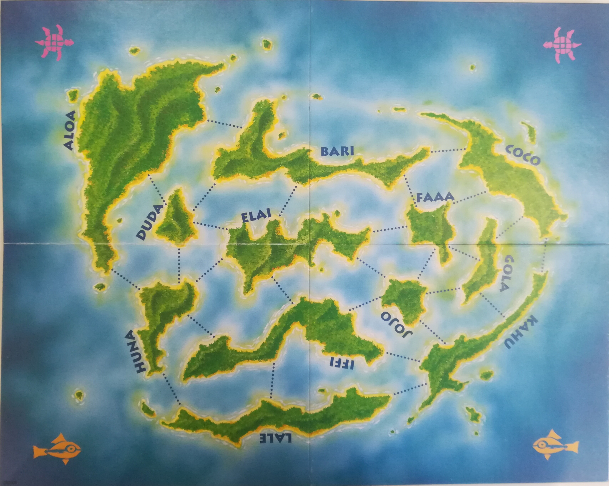

# Kahuna

Kahuna est un jeux de société créé par Günter Cornett; C'est un jeux de Stratégie pour 2 joueurs.

# But du jeux

Contrôler l'archipel de Kahuna en possédant un maximum de ses îles.

# Description

Les îles sont reliées par des liaisons, sur lesquelles il est possible de construire des ponts.
Lorsqu'un joueur a placé des ponts sur plus de la moitié des liaisons existante sur une île, cette île lui appartient.

# Mise en place

La carte est positionnée vierge.

Chaque joueur récupére les ponts et pions de sa couleur.

Chaque joueur reçoit 3 cartes.

3 cartes sont positionnées face visible sur le bord du plateau, et représente la pioche. Le reste des carte est disposé e ntas, face caché.

# Déroulement du jeux

Le jeux se déroule en 3 manches, 1 manche se termine lorsque le joueur a pris la derniére carte de la pioche.

Les joueurs alternent à tour de rôle, chaque tour de jeux se déroulant ainsi:

- Le joueur joue autant de carte qu'il le souhaite

- le joueur pioche parmis les 3 cartes de la pioche disponible, puis en retire une pour compléter le trio de pioche.

Un joueur ne peut avoir plus de 5 cartes en main, au risque de devoir défausser une carte pour en reprendre une 5e le cas échéant.

# Actions possibles

Construire un pont: 1 carte (on pose un pont sur n'importe quel liaison prenant ancrage sur l'île representée par la carte)
Lorsqe le pont construit donne au joueur la possession de l'île, les ponts adverses prenant ancrage sur cette île sont détruit.

Détruire un pont: 2 cartes identiques (on détruit n'importe quel pont prenant ancrage sur l'île représentée sur les cartes jouées)

Lorsqu'un pont est détruit, le joueur concerné peut perdre possession de l'île s'il n'a plus le nombre de pont nécessaire.

# Fin de manche

Chaque joueur garde ses cartes, ses ponts et ses îles.
Le jeux continue avec le joueur n'ayant pas terminé le précédent tour.
A la fin de la premiére manche, le joueur possédant le plus d'îles gagne 1pts.
A la fin de la deuxiéme manche, le joueur possédant le plus d'îles gagne 2pts.

# Calcul des points

A la fin de la 3e manche, on compte le nombre de point:
Chaque île possédée donne 1pts, auxquels ont ajoute les bonus de manche (1 pts pour la première manche, 2 pts pour la 2e).

# Carte

